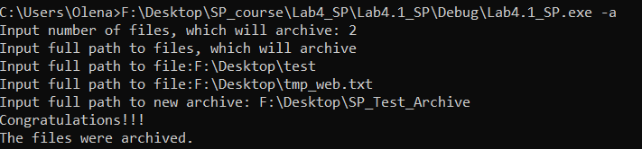
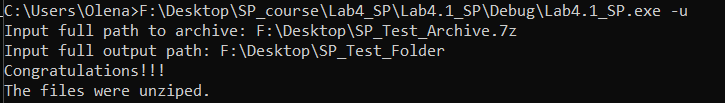
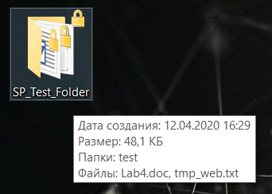
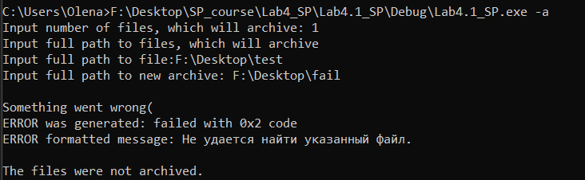

Написать программу, реализующую упаковку и распаковку zip архивов. Программа должна использовать утилиту 7z.exe, которая будет непосредственно выполнять упаковку и распаковку файлов путем запуска в дочернем процессе. Программа должна поддерживать такие операции как:
1.	Распаковка архива в папку
2.	Упаковка одного файла в новый архив

Утилита 7z.exe расположена в папке Debug

---
Results

---
Files, that will be archived.

Created archive

Result folder

Incorrect input

