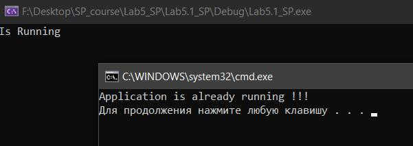
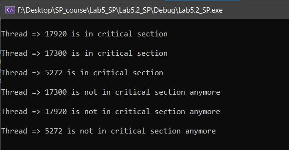
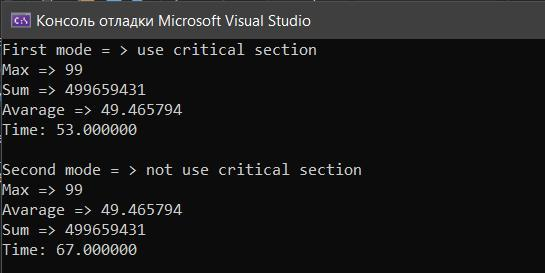

### **Программа 1:**

Требуется разработать программу, которая контролирует наличие только одного экземпляра самой программы в памяти. Т.е. при попытке запустить программу при уже наличии одного запущенного экземпляра, программа выдает ошибку о невозможности старта. Сама программа просто должна вывести в консоль фразу “Is Running” в случае успешного запуска.

**Программа должна использовать объект mutex для реализации поставленной задачи.**

---

**Result** Lab5.1_SP

---

### **Программа 2:**

Программа должна контролировать кол-во одновременно открытых указателей на файлы между всеми запущенными потоками. Приложение при старте создает заданное кол-во потоков, где каждый поток при старте переходит в спящий режим на период времени от 1 до 3 сек, потом пытается открыть файл для записи и записать в него время выполнения данной операции. После чего подождать от 1 до 3 сек. И закрыть файл. Программа в процессе работы не может открыть больше чем заданное кол-во файловых указателей. В случае когда уже новый поток не может превысить кол-во одновременно открытых файлов он ожидает пока хотя бы один файл не будет закрыт.

**Программа должна использовать считающий семафор.**

---

**Result** Lab5.2_SP

---

### **Программа 3:**

Необходимо написать программу, которая реализует 3х поточную работу (любой алгоритм: например 1 поток считает сумму чисел в массиве, 2ой поток считает среднее значение в массиве, 3ий поток считает макс. и мин значение в массиве). Сам алгоритм вычисления с обращением к критических операторам (обращение к массиву) должен быть реализован в виде взаимоисключения одновременного обращения к источнику данных (массиву). 
Задача: программа должна иметь 2 режима работы: с взаимоисключением и без. В каждом режиме должен производиться замер времени работы. Для получения более ощутимых интервалов работать с массивом от 50 тыс. элементов.

**Программа должна использовать критические секции для реализации взаимоисключения.**

---

**Result** Lab5.3_SP

---

