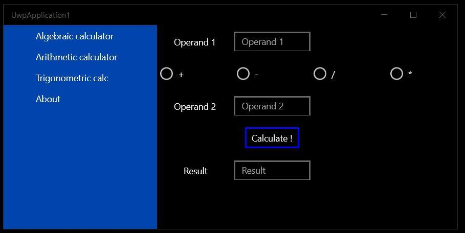
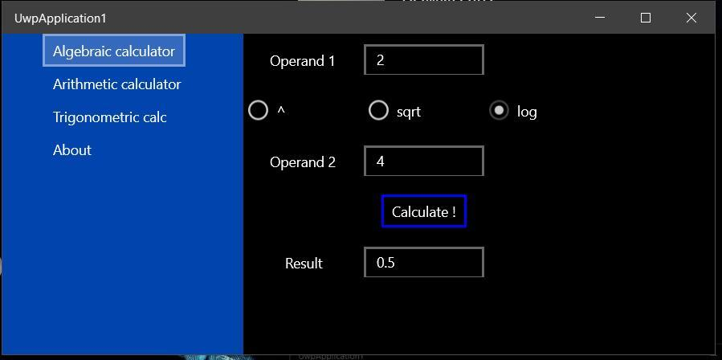
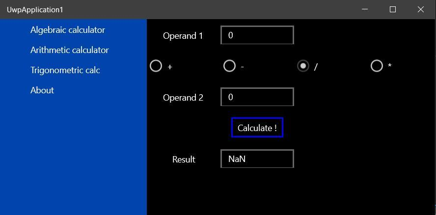
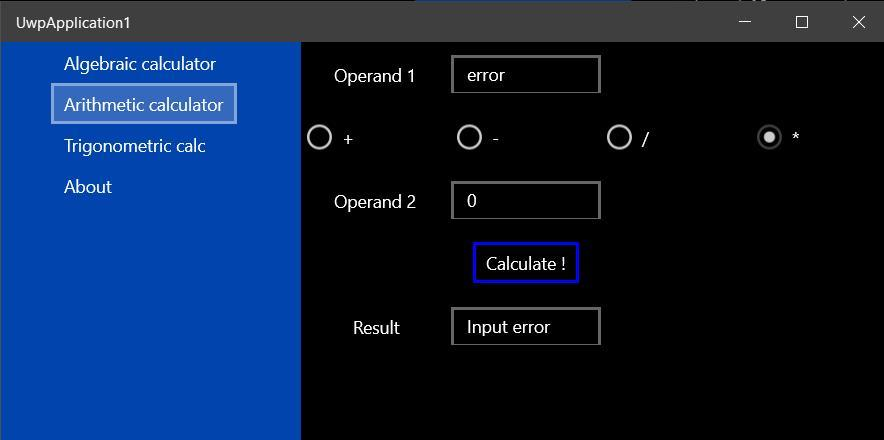
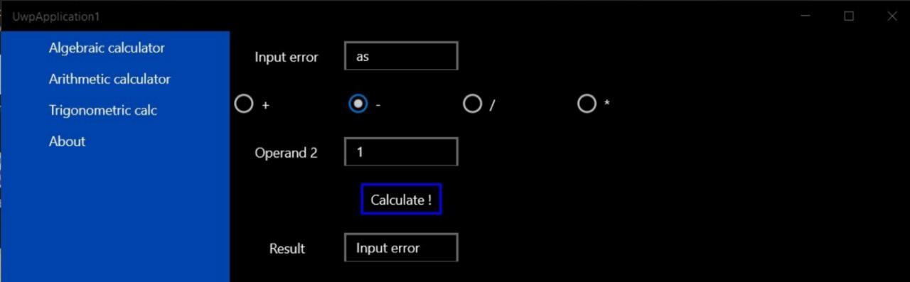
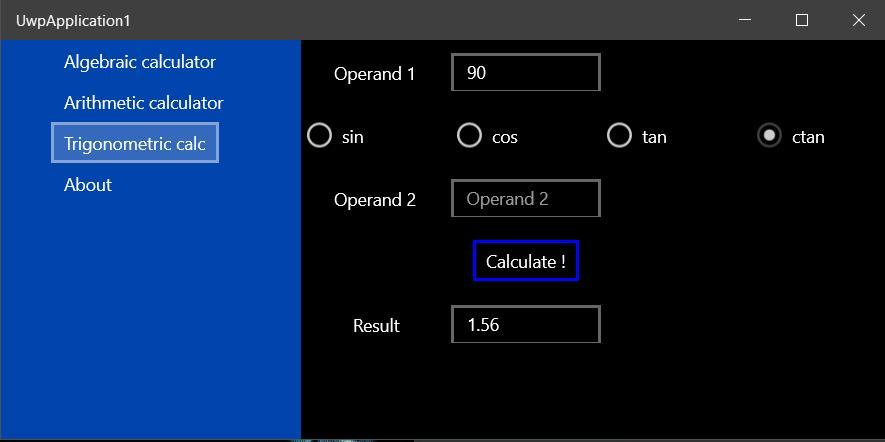
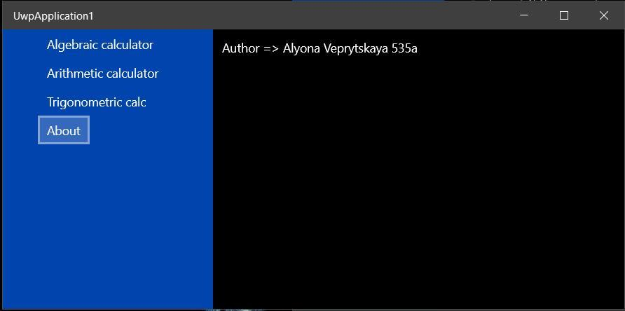

Необходимо создать оконное приложение, которое будет построено на базе проекта Universal Windows Application. Данное приложение должно будет включать 3 страницы:

-	Стартовая, построенная на базе одного из трех типовых элементов управления (выбрать согласно варианту задания).
-	Страница с информацией о разработчике.
-	Страница с реализацией, указанной в варианте задания, функции.

Вариант 2

**Элемент управления - SplitView**

Функции:
- Выполнить алгебраический калькулятор с корнем, логарифмом и степенями
- Выполнить арифметический калькулятор: сложение, вычитание, деление и умножение
- Выполнить тригонометрический калькулятор: sin, cos, tn

---

### **Results**

---

- algebraic mode

- arithmetic mode

- trigonometric mode

- about author

