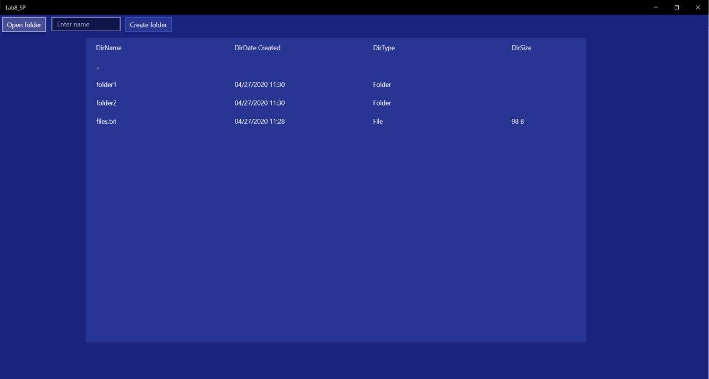

Необходимо создать оконное приложение, которое будет реализовывать функции файлового менеджера:
-	Отображать перечень файлов и папок в заданном каталоге.
-	Переходить в подкаталог по клику на папку.
-	Отображать для списка файлов размер (приведенный к Байтам, Кбайтам, МБайтам), дату создания, имя файла.
-	Предоставлять возможность смены каталога через FolderPicker

**Вариант 2 - Предоставить возможность создать или удалить папку**

---

### **Results**

---

